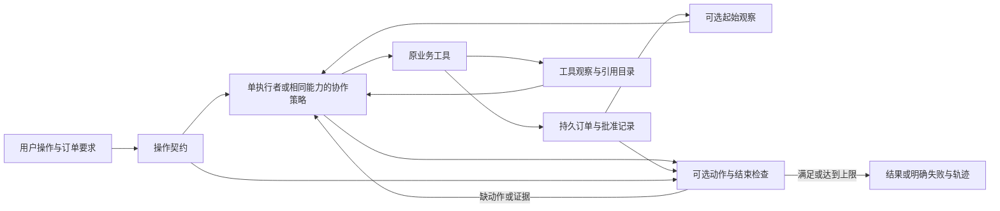

# ADR-0003：以订单状态和动作依据约束 Agent 完成声明

## 状态

在用户已授权的持续迭代范围内用于独立开发版本；尚未替换已验收工作台。设计、实现及实测结果公开在项目中供用户审阅。原v1和字段目录v2的代码、数据及结果保持冻结。

## 问题与要求

54次目录试跑减少了路径错误，却没有提高总完成数。典型失败是把草稿ID当作提案ID、没有读取已批准替代、文字称已选入但没有实际选择、修订完成后漏必要依据。

新版本要覆盖商品资料、订单核验、选入候选供审阅、准备提案和复核旧提案五种操作。服装规则、模拟边界、单仓走廊、人工批准替代和单独确认订单保持原定义。模型负责理解和选择，程序只执行工具与核验明确约束，不代替模型补做遗漏动作。

质量需要同时观察任务完成、业务状态、引用覆盖与误拒绝；运行代价包括初始化读取、检查次数、模型修复、token、费用、时延和最终失败。总预算480元，100模型子任务仍结束。不得增加服务依赖、真实下单或外部写操作。

## 决策

### 1. 显式操作契约

由调用者选择`inspect_product / check_order / stage_candidate / prepare_proposal / review_proposal`，附带所问SKU/字段、需处理行或目标提案。它描述用户要求，不包含正确SKU、最优路线、期望状态、案例类别或评分标签。自然语言仍保留；若操作模式与文字冲突，应暴露这一局限，不能偷偷用测试标签推断。

所有对照条件使用相同契约和模型提示。最终用户界面应使用“查商品”“核验订单”“候选选入审阅”“准备提案”“复核提案”等业务操作名称，不暴露实验标签。

### 2. 可溯源的起始状态

可选地由运行器在首次模型调用前读取一次当前订单，作为有观察ID的上下文。它包含真实草稿ID、当前选择、具体批准记录和提案列表；原请求SKU和已批准替代明确区分。该读取计入工具数量和32次共同上限，并单列为运行器发起的读取，不能藏掉这部分代价。后续变化仍通过工具观察，起始快照不保证一直新鲜。

### 3. 操作与结束检查

独立开关控制两类检查：复核模式下，未读取目标提案的有效性前不能创建替代提案；结束时，决定和必要来源必须匹配当前订单、真实选择与最新提案。候选选入只是暂存和生成待确认差异，不等于批准；未实际选入不能声称当前选中的是新SKU。

检查只读取本次操作契约、持久业务状态和工具观察，禁止导入实验案例、评分器或期望答案。失败反馈说明缺失状态或依据，让模型在原调用上限内自行修复。无解与澄清仍可作为正确业务结论；检查不能把这两种状态都强制变成“ready”。

专家可返回其局部结果；完整操作契约只约束最终根执行者。原专家路由与子任务边界暂不同时修改。所有版本都保留自由理由未被逐句证明的限制，并附实际执行记录；不自动把理由改写成成功声明。

## 替代方案与代价

- 只加提示：便宜，但目录试跑已经显示知道字段位置不等于完成操作；保留为对照条件。
- 静默读取并替模型补写所有证据：容易获得表面高分，但混淆模型执行和程序补全，也不能解决未发生的选择动作，不采用。
- 完整自由文本判官：能审查语义，却有费用、时延与误判；不能替代确定性状态核验。必要时在独立结果审核中使用。
- 立即更换框架或训练模型：本轮证据尚不能支持其投入，先保持同一模型与工具。

新机制会增加上下文、一次起始读取和检查成本。契约过严可能拒绝合理回答；需要专门的反例测试，尤其是无解、无需变更、引用父对象、合法比较原SKU库存、多行订单和已有具体批准。最终报告检查不能声称覆盖所有自然语言事实。

## 验证方式

先免费测试状态读取、错误ID、已批准替代、未执行选择、过期引用、正常/无解路线、无需修订、并发版本变化和达到调用上限。随后在新编写开发案例上比较“起始快照开/关 × 检查开/关”四种条件，每种分别使用三种执行策略。模型、目录、提示、操作契约、业务状态和上限固定，以区分两个干预的作用及交互。

此次旧54例只作失败诊断，不重新包装为未知测试。正式晋级还需独立未用案例、预先冻结方法和评分，并完整报告退步。原工作台继续使用已验收版本，直到新版本有足够的结果与界面验收依据。

## 依据

- [54次开发结果](../../research/APPAREL_EVIDENCE_PILOT_RESULTS.md)
- [失败逐例复核](../../research/APPAREL_EVIDENCE_PILOT_FAILURE_REVIEW.md)
- [原始三策略研究](../../research/APPAREL_RESULTS.md)
- [项目Harness阅读笔记](../../knowledge/vault/sources/zs-harness-engineering.md)
