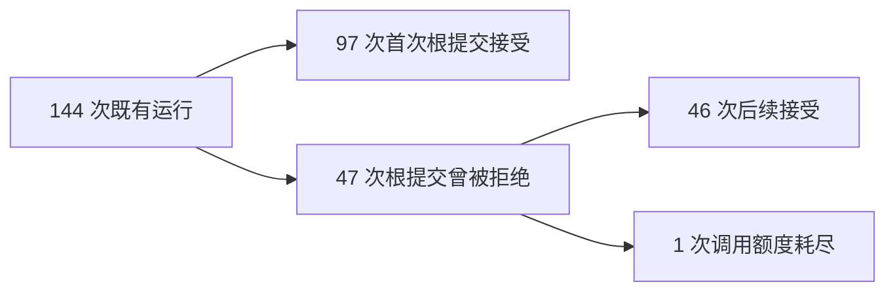

# 首次提交与拒绝后恢复：既有服装实验的轨迹分析

2026-09-09 · 追加的描述性分析 · 新增模型调用、业务运行和费用均为 0

原有 144 次运行最终通过 143 次；其中 97 次首次提交根报告就被接受，46 次在根报告被拒绝后修正通过，1 次最终未完成。首次被拒绝之后的后续工作占 80 次模型调用、估算费用 1.7747408 元。这说明最终通过率会掩盖修正过程，值得同时报告首次接受率和后续工作量；本分析没有设置关闭校验的对照，不能将这些恢复或费用全部归因于校验机制。

## 数据与口径

数据来自已完成的 proposal-review reliability study：24 个模拟业务状态 × v5/v6 两个版本 × 三种执行方式，每组 24 次。沿用原始 `evaluation.passed`、模型输出、费用和失败记录，没有重跑或修改评分。这是对同一批记录的补充分析，不是新增 144 个独立案例或用户。

“根报告”指单 Agent、协调员或按需委派执行者的最终报告。专家结束子任务单独统计，不计为整笔订单完成。首次接受仅要求根报告第一次调用 `finish` 被接受；此前仍可能有专家重试或业务工具失败，因此它也不是“一次调用成功率”。接受可以意味着正确地要求澄清或说明无可行方案，并不一定表示下单或发运成功。

每次运行均有根 `finish` 请求，且同一根模型响应最多只有一个此类请求。203 次根请求分为 143 次接受和 60 次拒绝：46 次来自内容、来源或操作核验，14 次来自参数结构或路由控制核验。另有 12 次运行发生共 13 次专家 `finish` 拒绝。

## 六组结果

| 版本与执行方式 | 原始任务通过 | 首次根提交接受 | 发生根拒绝的运行 | 后续接受 / 未完成 | 根拒绝次数 |
|---|---:|---:|---:|---:|---:|
| v5 单 Agent | 24/24 | 15/24 | 9 | 9 / 0 | 13 |
| v5 协调员加专家 | 23/24 | 15/24 | 9 | 8 / 1 | 14 |
| v5 按需委派 | 24/24 | 11/24 | 13 | 13 / 0 | 16 |
| v6 单 Agent | 24/24 | 21/24 | 3 | 3 / 0 | 3 |
| v6 协调员加专家 | 24/24 | 21/24 | 3 | 3 / 0 | 3 |
| v6 按需委派 | 24/24 | 14/24 | 10 | 10 / 0 | 11 |
| 合计 | 143/144 | 97/144 | 47 | 46 / 1 | 60 |

同一批状态上，v6 首次接受为 56/72，v5 为 41/72。版本变化包含多项指导与程序改动，不能把差异称为某一个 hook 的消融收益，也没有由此证明对新任务的泛化效果。



## 后续工作、费用与耗时

“后续”从第一次根报告被拒绝后开始，只统计此后发起的模型请求，不含产生该次拒绝的模型请求。若根响应先委派专家再提交报告，已完成的专家调用也不算在拒绝之后。后续调用可能执行原本必需的业务步骤，不等于可以省掉的重试开销。

| 版本与执行方式 | 后续模型调用 | 全组模型估算费用（元） | 其中后续估算费用（元） | 后续模型请求耗时合计（秒） | 全组每次运行平均耗时（秒） |
|---|---:|---:|---:|---:|---:|
| v5 单 Agent | 17 | 1.1296624 | 0.3243952 | 68.577 | 13.962 |
| v5 协调员加专家 | 19 | 3.0915200 | 0.4439600 | 85.574 | 38.829 |
| v5 按需委派 | 24 | 1.6342976 | 0.4693488 | 99.766 | 18.917 |
| v6 单 Agent | 3 | 1.0853616 | 0.0646368 | 13.890 | 12.167 |
| v6 协调员加专家 | 5 | 3.3876304 | 0.1438368 | 24.156 | 35.276 |
| v6 按需委派 | 12 | 1.8115440 | 0.3285632 | 57.379 | 17.137 |
| 合计 / 全部运行均值 | 80 | 12.1400160 | 1.7747408 | 349.342 | 22.715 |

后续共计 942,611 个输入 token 和 27,767 个输出 token。47 次发生根拒绝的运行，平均后续调用 1.70 次，平均后续估算费用约 0.03776 元。这些是条件于发生拒绝的描述性均值，不是新任务的费用预测。

v6 协调员和按需委派的后续调用及其费用下降，但全组总费用上升。不能只选下降的一列声称系统总体节费。模型请求耗时来自既有记录，包含网络和服务等待；合计不是恢复过程的完整墙钟时间，更不是纯思考时长。

745 次调用的原始费用估算合计为 12.1400160 元；逐次向上取整到百万分之一元后，合计为 12.140315 元，与该实验原账本及预留值一致。0.000299 元差异来自逐次舍入，不是本次新增消费；这里没有重新定价，也没有将本地估算当作服务商账单。

## 保留的失败

`RL-09-1-v5_coordinator` 没有最终报告。协调员委派专家后，第 8 次模型调用产生的根报告被内容核验拒绝；第 9 次调用的报告有 13 条引用，超过结构允许的 12 条；第 10 次再次被内容核验拒绝。随后委派因共享调用额度不足被拒绝，第 12 次模型响应只有文本，最终以 `call_limit` 结束。旧记录保持未完成，没有用后来成功的尝试替换它。

这个例子说明，拒绝不合格报告可以保留明确的失败状态，但并不保证剩余预算足够完成修正。当前结果也不能证明报告每句话都正确；自然语言依据仍须结合单独的解释审计。

## 复核与复现

分析前核对 289 个原始文件的 SHA256，并核对每份结果绑定的执行文件。另一个脚本通过“首个根 finish 所在模型响应是否也是最后一个根响应”交叉检查全部 144 条首次接受分类，并核对 CSV 与 JSON、逐次费用和舍入差额。

公开仓库先按 README 的 `init` 步骤还原已提供的实验压缩包，再在仓库根目录执行以下离线命令。无需 API Key，脚本只读已有实验文件；输出目录必须是新的。

```text
python research/apparel_harness_recovery.py --study evidence/apparel_reliability_study_v1 --reference reports/apparel_harness_recovery/analysis.json --output evidence/apparel_harness_recovery_reproduction
python research/verify_apparel_harness_recovery.py --study evidence/apparel_reliability_study_v1 --analysis evidence/apparel_harness_recovery_reproduction/analysis.json --cases evidence/apparel_harness_recovery_reproduction/cases.csv --output evidence/apparel_harness_recovery_reproduction/verification.json
```

`--reference` 读取已发布分析内的原始文件哈希。复现记录会有新的创建时间和 reference 文件哈希；比较 `totals`、`groups`、`rows`、`root_rejection_details` 及 `source_sha256_unchanged`，不要求整份新文件哈希等于原件。

局限包括：开发者设计的模拟状态、同批样本的回顾分析、无关闭校验对照、版本改动捆绑、同一状态跨组相关，以及根报告接受不等于全部自由文本正确。真实用户、真实交易和真实运输均为 0。
